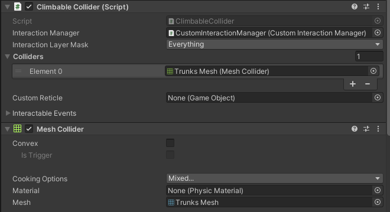

# Climbing System for Summoned Heroes of Sakura VR

Using the XR Interaction Toolkit 1.00 pre 6, the PlayerClimbingManager and ClimbableCollider scripts work together to create climbing functionality in Unity 2020.3.18f. These scripts communicate using the PlayerClimbingManager climbingHand static field, identifying the hand currently engaged in the climbing action. Climbing was crucial to the Summoned Heroes of Sakura VR project. The game's main objective is to climb the Collsuss Lump and strike him with the Battle Axe three times to win. I created the climbing scripts before we started prototyping, ensuring that we could make climbing work before we began development, as the game's core idea would not work without it.

## Climbable Collider Script Overview:

The Climbable Collider script is attached to the in-game object with a collider. After attaching the script, you must populate the collider and interaction manager in the inspector.



When a user interacts with a climbable object, the ClimbableCollider script detects direct interactions on the climbable object through the OnSelectEntered method. This method will confirm that the player's controller object (interactor) has an XRDirectInteractor script attached. Once confirmed, the method retrieves the ActionBasedController from the player's controller (interactor) and assigns it to the PlayerClimbingManager.climbingHand. The ActionBasedController lets the PlayerClimbingManager know which hand is trying to climb.

An XRDirectInteractor will only function if the player presses the grab button on the controller, so the code explained above would get called whenever a user presses or releases the grip button. When the player releases the grip button currently climbing, the climbingHand variable will be set to null. Setting the climbingHand varible to null tells the PlayerClimbingManager that the climbing action has ended with that hand.

See Script Below

```cs

using UnityEngine.XR.Interaction.Toolkit;

public class ClimbableCollider : XRBaseInteractable
{
    // Method is triggered when a XRBaseInteractor enters the collision zone of the climbable collider
    // This is usually when the user grabs or holds onto the climbable collider
    [System.Obsolete] 
    protected override void OnSelectEntered(XRBaseInteractor interactor)
    {
        base.OnSelectEntered(interactor); 

        // If the interactor is an XRDirectInteractor (indicating direct physical interaction in VR)
        if (interactor is XRDirectInteractor)
        {
            // Retrieve the ActionBasedController component from the interactor and set it as the current climbing hand in the PlayerClimbingManager
            PlayerClimbingManager.climbingHand = interactor.GetComponent<ActionBasedController>();
        }
    }

    // Method is triggered when a XRBaseInteractor exits the collision zone of the climbable collider
    // This is usually when the user releases or lets go of the climbable collider
    [System.Obsolete] 
    protected override void OnSelectExited(XRBaseInteractor interactor)
    {
        base.OnSelectExited(interactor); 

        // If the interactor is an XRDirectInteractor (indicating direct physical interaction in VR)
        if (interactor is XRDirectInteractor)
        {
            // If the current climbing hand in the PlayerClimbingManager exists and its name matches the name of the interactor
            if (PlayerClimbingManager.climbingHand && PlayerClimbingManager.climbingHand.name == interactor.name)
            {
                // Set the current climbing hand in the PlayerClimbingManager to null
                PlayerClimbingManager.climbingHand = null;
            }
        }
    }
}

``````

## Climbing Manager Script Overview:

The Climbing Manager script is attached to the XR-rig/player, and nothing needs to be populated in the inspector.


The PlayerClimbingManager script receives and processes this information during physics updates in the FixedUpdate method. If the climbingHand field is not null, this indicates active climbing, and the script will calculate the hand's velocity and position and make the climbing action accordingly.

Essentially, the PlayerClimbingManager script utilizes the information provided by the ClimbableCollider script to control the execution of the climbing mechanics. On the other hand, the ClimbableCollider script translates user interactions into data that the PlayerClimbingManager can utilize through the climbingHand field. 

See Script Below 

```cs
using UnityEngine;
using UnityEngine.XR.Interaction.Toolkit;

public class PlayerClimbingManager : MonoBehaviour
{
    private CharacterController characterController;
    private ContinuousMoveProviderBase continuousMovement;

    // A static field that represents the player's hand or game object with the XR controller component 
    public static ActionBasedController climbingHand;

    // Fields to store previous hand state and calculate climbing velocity
    private ActionBasedController previousHand;

    private Vector3 previousPos;
    private Vector3 currentVelocity;

    void Start()
    {
        characterController = GetComponent<CharacterController>();
        continuousMovement = GetComponent<ContinuousMoveProviderBase>();
    }

    // FixedUpdate is called once per physics update in Unity
    void FixedUpdate()
    {
        if (climbingHand) // Check if a climbing hand has been assigned by a ClimbInteractable instance
        {
            // If the hand is moving, calculate the velocity and disable continuous movement
            if (previousHand == null || climbingHand.name != previousHand.name)
            {
                previousHand = climbingHand;
                previousPos = climbingHand.positionAction.action.ReadValue<Vector3>();
            }
            continuousMovement.enabled = false; // Disables continuous movement when the user is climbing 
            Climb(); // Perform the climbing movement
        }
        else
        {
            // If the hand is not climbing, enable continuous movement
            continuousMovement.enabled = true;
        }
    }

    // The Climb method performs the climbing movement
    private void Climb()
    {
        // Calculate the current velocity of the hand by comparing the current and previous position of the hand
        currentVelocity = (climbingHand.positionAction.action.ReadValue<Vector3>() - previousPos) / Time.deltaTime;
        // Apply the opposite of the calculated velocity to the character controller, effectively creating the climbing motion
        characterController.Move(transform.rotation * -currentVelocity * Time.deltaTime);

        // Update the previous position to the current position for the next frame
        previousPos = climbingHand.positionAction.action.ReadValue<Vector3>();
    }
}
``````
##