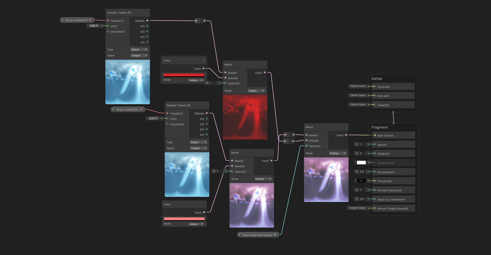

# Shaders and VFX for Summoned Heroes of Sakura VR

I created eight unique shaders used in the Summoned Heroes of Sakura project. The shaders included fish, seaweed, wind, water, lava, terrain, crystal, and colour-changing sky. I created these shaders to bring movement and life to the Japanese Zen Garden and hell-themed battle area. I also made a handful of visual effects (VFX), including fog, flower petals, bubbles in the lava, and smoke from the lava. I created each shader using Shader Graph in Unity 2020.18.f and made the VFX using the particle effects in Unity.

See the shader graph for each shader below. 

## Landscape Vertex Paint Shader

I created this shader for the Zen Garden and Hell Battle Area landscape. This shader is a vertex paint shader, allowing a different texture for each RGBA colour channel. The colour channels enable the shader to have up to four tiling materials be one draw call instead of four. To paint on the different textures, you need a vertex paint plugin and then paint the colour you set the texture to. (i.e. if you paint red, it will show dirt, if you paint green, it will show grass, etc.)

## Foliage Vertex Movement Shader

I created this shader for the foliage, adding movement to the leaves mesh, which simulated wind. The shader will move vertices in the mesh in random directions. The direction the vertices will go depends on the speed and direction variables. The foliage mesh will move anywhere in world space on the X and Y axis. Each vertex movement shader has a time node. Without this node, the vertices would not move. To speed up or slow down the speed of the effect, you would multiply it by time. 

## Water Vertex Movement Shader

I created this shader for the water in the Zen Garden environment. This shader is also a vertex movement shader, like the foliage shader. The shader also moves the mesh on the X and Y axis but has a sine wave to add a uniform back-and-forth motion. The sine wave motion allows the water to have ripples and waves like water in real life. The foam is created by adding a noise mask to the water base colour and by using a step node to determine where the water's edge is. To get the right colour and transparency of the water, I added a depth fade node and lerped end value to make the water look like it has depth. 

## Seaweed Vertex Movement Shader

I created this shader to add movement to the seaweed in the water. This shader is also a vertex movement shader, like the foliage and water shader. The shader moves the mesh on the X and Y axis and sine wave. The sine wave allows the seaweed to move back and forth in the water as if the waves were pushing the seaweed back and forth. 

## Koi Fish Vertex Movement Shader

I created this shader to add movement to the koi fish in the water. This shader is also a vertex movement shader, like the foliage, water, and seaweed shader. The shader moves the mesh on the X and Y axis and sine wave. The sine wave allows the fish to move back and forth, up and down in the water, as if the waves were pushing the fish around in the water.  

## Lava Lake and Falls Movement Shader

I created this shader for the lava lake and lava falls in the Hell Battle Area environment. The shader moves the noise map on the X and Y axis, acting like the lava was moving around. The lava look is created by blending different noise maps while using a texture map for the base. I added a Fresnel effect to add a glow to the lava's edges.

 ## Crystal Shader

I created this shader to add a crystal-like material to the emissive Japanese symbols. The symbols were over the golden gate to the bridge. The shader uses a Fresnel effect to add a glow to the outside edges. The colour was created from various gradients multiplied together.

## Sky Shader

I created this shader for when the players reach the bridge's halfway point. The sky will change colours to a more red colour. The colour is modified by adding a tint to the main skybox texture. 
